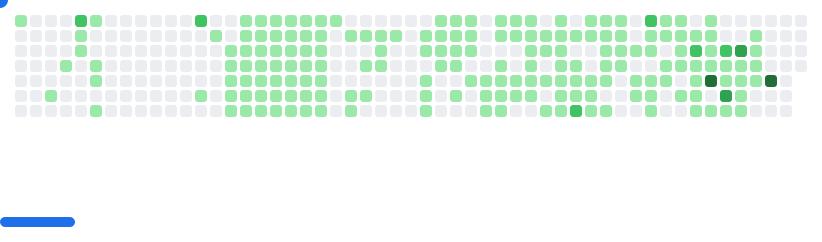

# Hello, I'm Nathanael 👋

## 👨‍💻 About Me

- 📝 I'm currently studying computer engineering.
- 💻 Trying to get better at C++.
- ♟️ I love to play chess!

<!--## 🛠️ Technologies & Tools

### Languages

### Tools & Frameworks

-->
<!--
## 📈 GitHub Stats

-->

<!-- Stolen from someone else -->
<picture>
  <source
    media="(prefers-color-scheme: dark)"
    srcset="images/breakout-dark.svg"
  />
  <source
    media="(prefers-color-scheme: light)"
    srcset="images/breakout-light.svg"
  />
  
</picture>

## 🔗 Connect with Me

